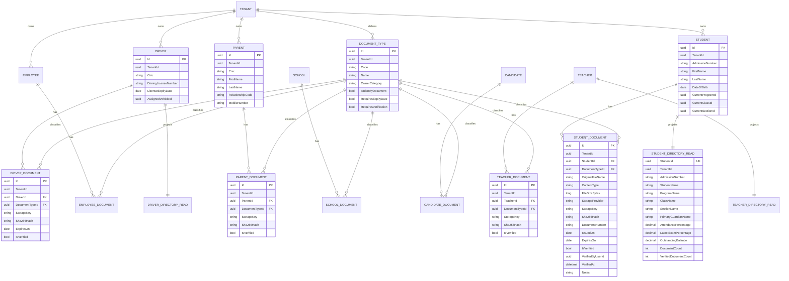

# SmartSchool Comprehensive ERD — Documents and Read Models

## Design decisions

1. **Separate owner document tables** are intentional. Student, parent, teacher, driver, candidate and school documents have different authorization, retention, verification and required-document policies.
2. **DocumentType is normalized**. Birth certificate, B-Form, CNIC front/back, passport, degree, experience certificate, driving license and similar categories are data rather than repeated strings.
3. **File bytes are not stored in PostgreSQL/SQL Server by default.** Relational tables hold metadata; the storage abstraction holds the file in Local/S3/Azure Blob or another provider.
4. **StorageKey is private**, not a permanent public URL. Download APIs should authorize the caller and return/stream the file or issue a short-lived signed URL.
5. **SHA-256** supports integrity checks and duplicate detection.
6. **CNIC/document numbers are sensitive PII.** They should be encrypted/tokenized where required, excluded from ordinary list DTOs and never logged.
7. **Read tables are application-managed materialized projections.** This keeps the architecture portable between PostgreSQL and SQL Server while providing fast dashboards and directories.
8. Transactional normalized tables remain the system of record. Read tables may be rebuilt if necessary.
